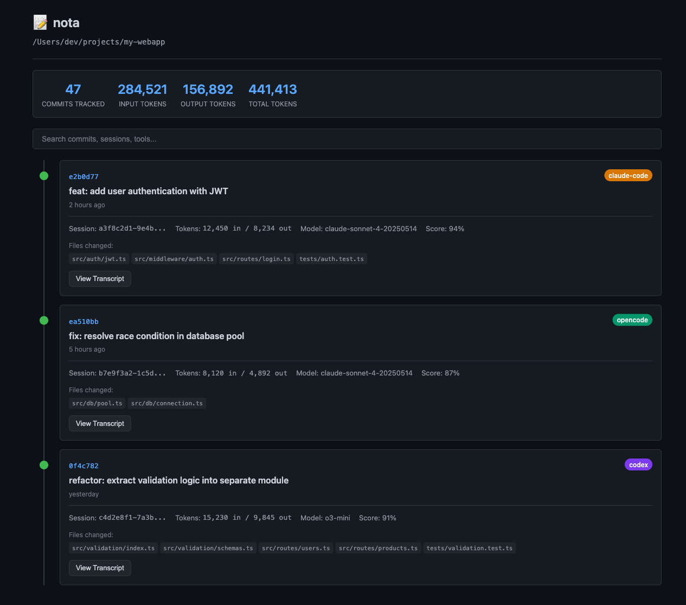
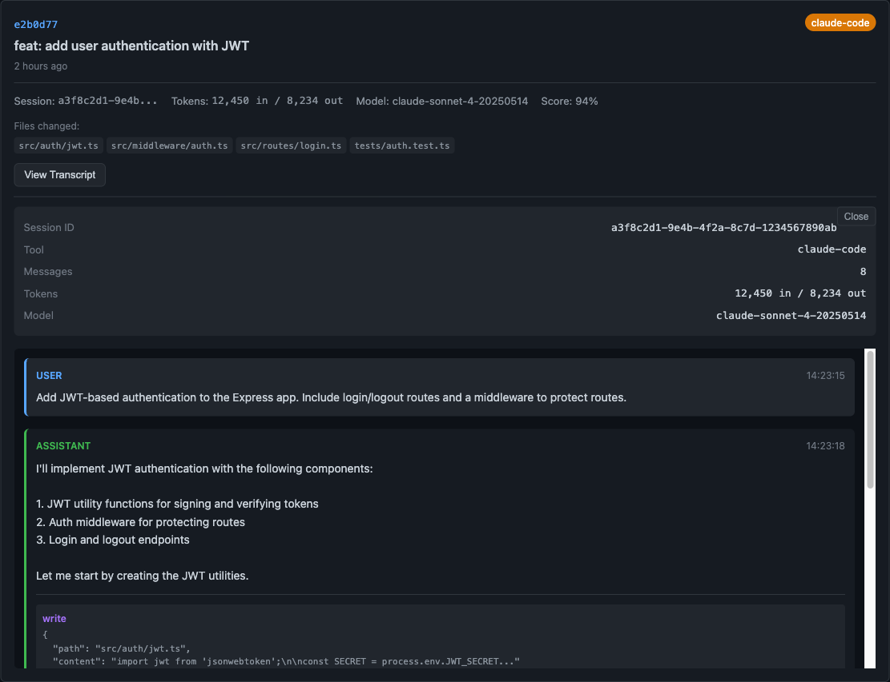
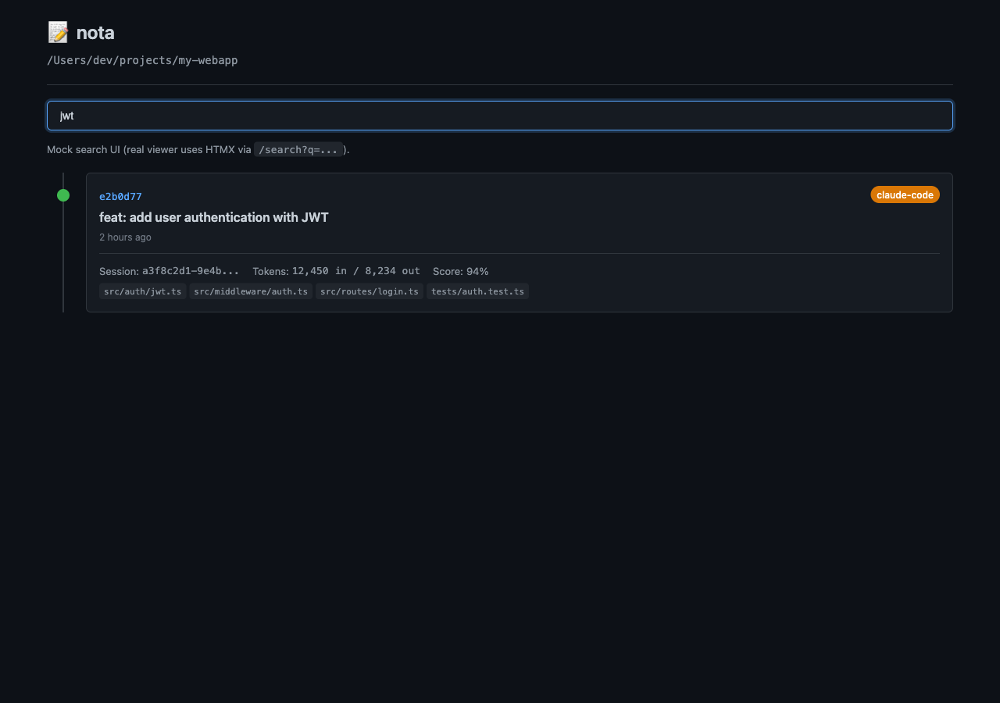
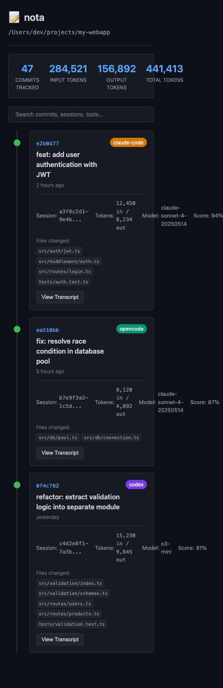

# nota

A CLI tool that extracts AI coding assistant transcripts and links them to git commits using git notes.

**nota** provides visibility into how AI-assisted changes flow into your codebase, with a web viewer for exploring the history.

## Supported AI Assistants

- **Claude Code** - `~/.claude/projects/`
- **OpenCode** - `~/.local/share/opencode/storage/`
- **Codex** - `~/.codex/sessions/`

## Installation

```bash
# Build from source
git clone https://github.com/your-org/nota.git
cd nota
make build

# Or install to your PATH
make install
```

## Quick Start

```bash
# See AI sessions related to the current repo
nota extract

# Start the web viewer
nota serve
# Open http://localhost:8080

# Install git hook for automatic tracking
nota install
```

## Example Output (Mock)

The examples and screenshots below use mock data (no local transcripts).

### `nota extract`

```text
$ nota extract
TOOL        SESSION ID        MESSAGES  TOKENS (IN/OUT)   START TIME         DIRECTORY
----        ----------        --------  ---------------   ----------         ---------
claude-code a3f8c2d1-9e4b...  18        12450/8234        2026-02-01 14:23   /Users/dev/projects/my-webapp
opencode    b7e9f3a2-1c5d...  11        8120/4892         2026-02-01 09:18   /Users/dev/projects/my-webapp
codex       c4d2e8f1-7a3b...  25        15230/9845        2026-01-31 16:40   /Users/dev/projects/my-webapp

Total: 3 sessions
```

### `nota post-commit --dry-run`

```text
$ nota post-commit --dry-run
Would add note to commit e2b0d77:
  Tool: claude-code
  Session: a3f8c2d1-9e4b-4f2a-8c7d-1234567890ab
  Tokens: 12450 in / 8234 out
  Match score: 0.94
```

### `nota notes list`

```text
$ nota notes list
COMMIT    TOOL        SESSION           TOKENS (IN/OUT)  SCORE  TIMESTAMP
------    ----        -------           ---------------  -----  ---------
e2b0d77   claude-code  a3f8c2d1-9e4b...  12450/8234       0.94   2026-02-01 14:28
ea510bb   opencode     b7e9f3a2-1c5d...  8120/4892        0.87   2026-02-01 10:02
0f4c782   codex        c4d2e8f1-7a3b...  15230/9845       0.91   2026-01-31 18:11

Total: 3 notes
```

### `nota serve`

```text
$ nota serve
Starting nota viewer at http://localhost:8080
```

## Web Viewer

Start the viewer with `nota serve` and open `http://localhost:8080`.

Screenshots (mock data generated from `docs/screenshots/mock-viewer*.html`):









## Commands

### `nota extract`

Extract AI transcripts without modifying the repository.

```bash
nota extract              # Sessions for current repo
nota extract --all        # All sessions across all repos
nota extract --tool claude-code # Only Claude Code sessions
nota extract --output json # JSON output
```

### `nota post-commit`

Link AI sessions to commits (usually called by git hook).

```bash
nota post-commit              # Link to HEAD
nota post-commit --commit abc123
nota post-commit --dry-run    # Preview without modifying
```

### `nota notes`

Manage git notes containing AI transcript metadata.

```bash
nota notes list               # Show all linked commits
nota notes export             # Export as JSON
nota notes export --format csv
```

### `nota install`

Install/uninstall the post-commit git hook.

```bash
nota install                  # Install hook
nota install --uninstall      # Remove hook
```

### `nota serve`

Start the HTMX web viewer for browsing transcripts.

```bash
nota serve                    # Default port 8080
nota serve --port 3000
```

## How It Works

1. **Extraction**: nota reads session files from AI assistant data directories and parses the conversation history (JSONL for Claude/Codex, JSON for OpenCode).

2. **Matching**: When linking to commits, nota uses multiple signals to match sessions:
   - Temporal proximity (session time vs commit time)
   - File overlap (files touched in session vs files in commit)
   - Working directory matching

3. **Storage**: Metadata is stored in git notes under `refs/notes/ai-transcripts`, making it visible in `git log` and portable with the repo.

4. **Viewing**: The web viewer provides an HTMX-powered timeline with search, infinite scroll, and expandable transcripts.

## Development

```bash
make help       # Show all targets
make build      # Build binary
make test       # Run tests
make demo       # Quick feature demo
make serve      # Build and start web viewer
```

## License

MIT
